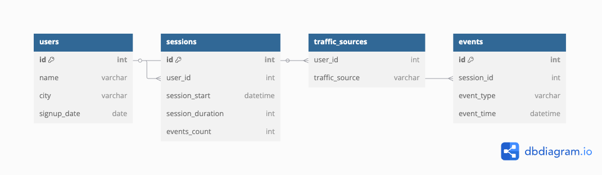

# Website Traffic Analysis (SQL) / Аналіз трафіку сайту

---

## 🇬🇧 English

**Description:**  
This project analyzes website user behavior using SQL queries. It explores traffic sources, user activity, engagement, and returning visits.

**Data Structure:**
- **users** (id, name, city, signup_date) — user info
- **sessions** (id, user_id, session_start, session_duration, events_count) — user sessions
- **traffic_sources** (user_id, traffic_source) — traffic sources
- **events** (id, session_id, event_type, event_time) — user events

**How to use:**
1. Import `sample_data.sql` into your database (PostgreSQL/MySQL/SQLite).
2. Run queries from `queries.sql`.
3. See example results in the `results/` folder.

**ER Diagram:**  

**SQL Queries:**  
See [`queries.sql`](queries.sql)

**Results:**  
Screenshots and sample outputs are in the `results/` folder.

---

## 🇺🇦 Українська

**Опис:**  
Цей проєкт присвячений аналізу поведінки користувачів на сайті за допомогою SQL-запитів. Досліджуються джерела трафіку, активність користувачів, залученість та повторні візити.

**Структура даних:**
- **users** (id, name, city, signup_date) — інформація про користувачів
- **sessions** (id, user_id, session_start, session_duration, events_count) — сесії користувачів
- **traffic_sources** (user_id, traffic_source) — джерела трафіку
- **events** (id, session_id, event_type, event_time) — дії користувачів

**Як використовувати:**
1. Імпортуйте `sample_data.sql` у свою базу даних (PostgreSQL/MySQL/SQLite).
2. Виконайте запити з файлу `queries.sql`.
3. Дивіться приклади результатів у папці `results/`.

**ER-діаграма:**  

**SQL-запити:**  
Див. [`queries.sql`](queries.sql)

**Результати:**  
Скріншоти та приклади результатів — у папці `results/`.

---

**Author / Автор:**  
Vitaliy Zaburdaev  
[GitHub](https://github.com/zaburdaev) | [LinkedIn](https://www.linkedin.com/in/vitalii-zaburdaiev/)